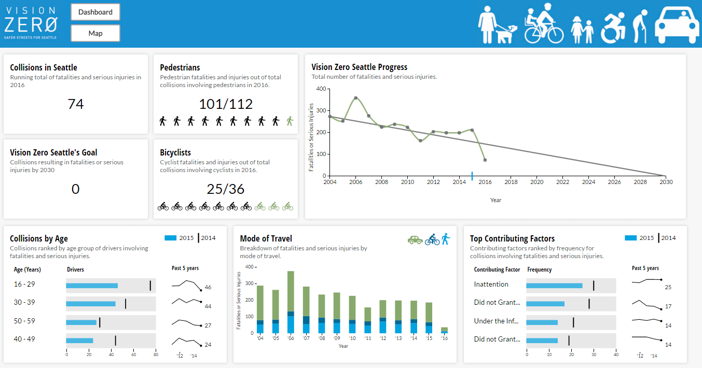
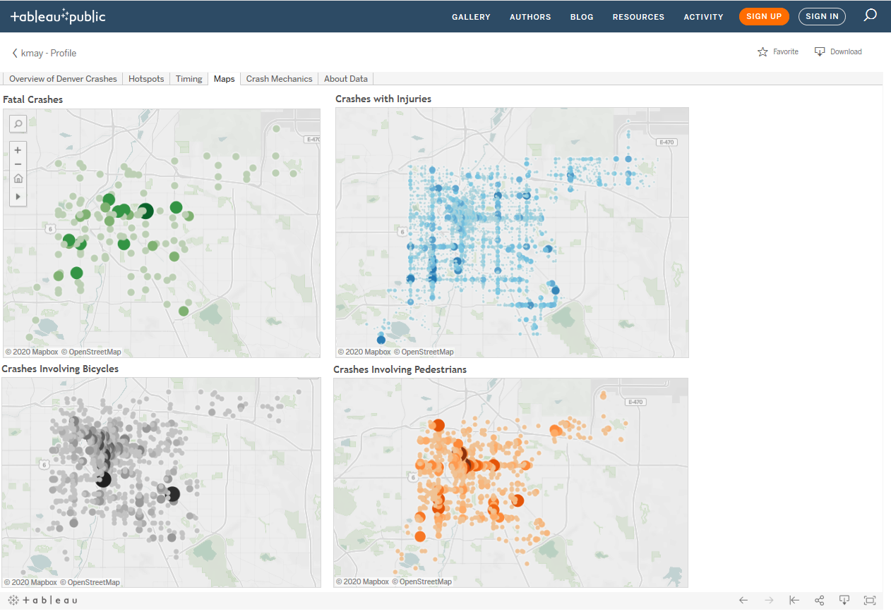
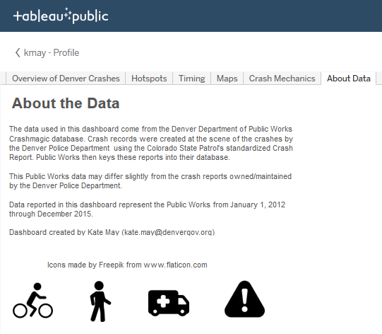

Some examples of vision zero dashboards from around the country.

## Illinois Department of Transportation (IDOT)

http://apps.dot.illinois.gov/fatalcrash/snapshot.html

Key features:

 - At a glance window (high profile attributes)
 - Key terms window
 - Ability to view past years’ data

## Seattle

This dashboard is no longer online, but you can see the example from their blog as of 2016: https://sdotblog.seattle.gov/2016/06/10/new-vision-zero-dashboard-now-online/

Key features:

 - Distinct key stats page
 - Separate map page

Dashboard View:

Map View:

## Seattle (New Socrata Dashboard)

Seattle has worked with Socrata to create a new dashboard, here: https://snudot-visionzero.connect.socrata.com

 
## Denver

This is a static analysis built in Tabluau.  It does not update.

https://public.tableau.com/profile/kmay#!/vizhome/DenverVisionZeroDashboard/OverviewofDenverCrashes
 
Key features
 - Key stats listed
 - Multiple attributes visualized
 - Nominal maps
 - "Brushing" which allows users to select a category and all visualizations automatically filter to that selection
 - About page that describes data and methodology

#### Overview

#### Hotspots

#### Timings

#### Maps

#### Crash Mechanics

#### About Page

## Portland

Based on ESRI

(Note not accessible as of 1/8/20)
https://pdx.maps.arcgis.com/apps/MapSeries/index.html?appid=47c2153a3fa84636bb63e25b451372d0

Key features

 - High Crash Corridors mapped
 - Allows filtering of data

 

## Washington DC
 
https://www.dcvisionzero.com/maps-data

Key features

 - Statistical Analysis w/map
 - Visualized Stats
 - Allows filtering of data

## SFO
 
https://www.visionzerosf.org/maps-data/

Key features
 - High Crash Network mapped
 - Monthly summary report
 
## LA

http://visionzero.geohub.lacity.org/

Key features
 - High Crash Network mapped
 - Community Data
 - Crashes animated over time
 - Link to data download
 

## Denver

https://geospatialdenver.maps.arcgis.com/apps/MapJournal/index.html?appid=e333ca7679ec40c2a3ef449e3b111743

 - Socioeconomics vs. High crash areas mapped
 

## New York
NY: http://crashmapper.org/#/?cfat=true&cinj=true&endDate=2019-02&geo=citywide&identifier=&lat=40.696518118094616&lng=-73.91738891601562&lngLats=%255B%255D&mfat=true&minj=true&noInjFat=false&pfat=true&pinj=true&startDate=2019-02&zoom=11

 - Allows filtering by time & geography
 - Focuses only on crash attributes
 - Created by a citizen

link for query below

 
 
## Toronto

https://www.toronto.ca/services-payments/streets-parking-transportation/road-safety/vision-zero/safety-measures-and-mapping/

Key features
 - Allows filtering by geographies
 - Safety improvements mapped

 
## New York (citizen created)

http://www.nycvzv.info/

Key features
 - Statistics with map
 - Street improvement information
 - Public input option
 - Ability to download data
 - NYCDOT maintained
 

## Prototype Visualization for Fatal Crash Committee
 
 
Sid's Prototype for the crash committee:

https://siddharthsilver.wixsite.com/fatalcrashdashboard
 

